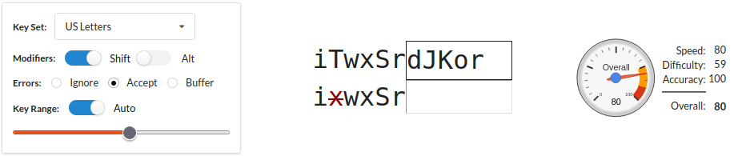

# Arketyper Documentation
Arketyper is web application for gradually improving typing skill on unfamiliar keyboards.

> :bulb: If you'd like a keyboard layout added please [contact me](https://www.freshcode.biz/).

## Instructions
1. Configure the settings on the left (see below)
2. Start typing in the input field in the center
3. Monitor your results on the right

## Configuration
**Key Set**: The layout and number of keys to use (start with just letters) 

**Modifiers**: Opt in/out of Shift & Alt keys (turn these off to get started)

**Errors**: Choose how incorrect key strokes are handled...
* Ignore - Incorrect keystrokes are ignored so you can reattempt
* Accept - Incorrect keystrokes are accepted and will be reflected in your 'accuracy' score
* Buffer - Incorrect keystrokes must be backspaced before proceeding. This is the most realistic.

### Target Difficulty  
Limiting the difficulty will allow you to **focus on a smaller, easier subset of keys to practice**.  
Allow automatic difficulty adjustment or select your desired difficulty (and turn off 'Auto')

## Scoring
* Speed: Is a measure of interval between 'accepted' keystrokes
* Difficulty: Is a measure of the how easy or hard a key is to press. E.g. Home keys are easy.
* Accuracy: Is a measure of the number of mistakes made. This matters only for 'Accept' error handling.
* Overall: Is a combination of speed, difficulty and accuracy